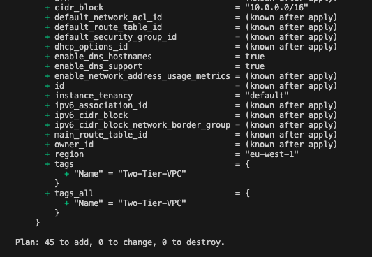

# Two-Tier AWS Infrastructure with Terraform

[](https://terraform.io)
[](https://aws.amazon.com)
[](LICENSE)
[](https://terraform.io)

## 📋 Table of Contents

- [Use Case](#use-case)
- [Overview](#overview)
- [Architecture](#architecture)
- [Prerequisites](#prerequisites)
- [Project Structure](#project-structure)
- [Quick Start](#quick-start)
- [Configuration](#configuration)
- [Deployment](#deployment)
- [Monitoring & Logging](#monitoring--logging)
- [Security](#security)
- [Troubleshooting](#troubleshooting)
- [Cost Optimization](#cost-optimization)
- [Contributing](#contributing)

## 💼 Use Case

### **Scenario: CloudAutomation Solutions - Enterprise Migration**

You are a **Senior Cloud Infrastructure Engineer** at **CloudAutomation Solutions**, a digital transformation consultancy that helps enterprises migrate their legacy applications to the cloud. Your team has been contracted by a major financial services company to modernize their customer-facing web application that currently runs on on-premises infrastructure.

#### **Client Requirements:**
- 🏢 **Legacy Challenge**: Replace aging on-premises infrastructure running a monolithic web application
- 📈 **Scale Expectations**: Handle 10,000+ concurrent users during peak trading hours
- 🔒 **Security Compliance**: Meet strict financial regulations (PCI DSS, SOC 2 compliance)
- ⏰ **High Availability**: 99.95% uptime SLA with < 2 seconds response time
- 🌍 **Global Reach**: Serve customers across multiple geographic regions
- 💰 **Cost Control**: Reduce infrastructure costs by 40% while improving performance

#### **Your Mission:**
Deploy a **production-ready two-tier architecture** that provides:

1. **Web Tier**: Auto-scaling application servers behind a load balancer
2. **Database Tier**: Highly available Aurora MySQL cluster with read replicas
3. **Security Layer**: WAF protection, encryption at rest/transit, and network isolation
4. **Global Distribution**: CDN for improved performance and reduced latency
5. **Disaster Recovery**: Multi-AZ deployment with automated backups

#### **Technical Challenges to Solve:**
- **Traffic Spikes**: Handle sudden load increases during market volatility
- **Database Performance**: Optimize read-heavy workloads with read replicas  
- **Security**: Implement defense-in-depth with multiple security layers
- **Monitoring**: Real-time observability for proactive issue resolution
- **Cost Optimization**: Auto-scaling to match demand and minimize waste

#### **Success Metrics:**
- ✅ **Performance**: Sub-2 second page load times globally
- ✅ **Scalability**: Automatic scaling from 2 to 20+ instances based on demand
- ✅ **Availability**: Zero unplanned downtime during 6-month pilot period  
- ✅ **Security**: Pass all compliance audits and penetration tests
- ✅ **Cost Efficiency**: 40% reduction in total infrastructure costs

This Terraform infrastructure provides the foundation to meet all these requirements through **Infrastructure as Code**, enabling repeatable, consistent deployments across multiple environments (dev/staging/production) while maintaining enterprise-grade security and performance standards.

---

## 📌 Overview

This project implements a **production-ready two-tier web application architecture** on AWS using Infrastructure as Code (IaC) with Terraform. The architecture follows AWS Well-Architected Framework principles and implements industry best practices for security, scalability, and high availability.  

### 🎯 Business Objectives

- **Scalability**: Handle variable traffic loads with auto-scaling capabilities
- **High Availability**: 99.99% uptime with multi-AZ deployment
- **Security**: Zero-trust security model with WAF, encryption, and IAM
- **Cost Optimization**: Right-sized resources with automated scaling
- **Maintainability**: Modular, version-controlled infrastructure

### ✨ Key Features

- 🏗️ **Modular Terraform Architecture** - Reusable, maintainable modules
- 🔒 **Security-First Design** - WAF, encryption at rest/transit, security groups
- 📈 **Auto Scaling & Load Balancing** - Dynamic scaling based on metrics
- 🌐 **Global Content Delivery** - CloudFront CDN with edge locations
- 🛡️ **SSL/TLS Termination** - AWS Certificate Manager integration
- 📊 **Monitoring & Alerting** - CloudWatch metrics and alarms
- 🗃️ **Database High Availability** - RDS Aurora with read replicas
- 🌍 **DNS Management** - Route 53 with health checks

## 🏗️ Architecture


### 📋 Terraform Infrastructure Planning

The deployment begins with Terraform planning phase, showing all resources to be created:



*Terraform plan output showing VPC infrastructure components to be provisioned*

### 🌐 Deployed AWS Infrastructure

Below is the actual deployed infrastructure in AWS Console, showing the complete two-tier architecture:


*AWS VPC Console showing the deployed Two-Tier-VPC with all networking components*

### 🏛️ Architecture Components

| Tier | Component | Purpose | Availability |
|------|-----------|---------|--------------|
| **Web Tier** | Application Load Balancer | Traffic distribution & SSL termination | Multi-AZ |
| **Web Tier** | Auto Scaling Group | Dynamic EC2 instance management | Multi-AZ |
| **Web Tier** | EC2 Instances | Application hosting | Multi-AZ |
| **Database Tier** | RDS Aurora MySQL | Primary database cluster | Multi-AZ |
| **Database Tier** | Aurora Read Replica | Read scaling & disaster recovery | Multi-AZ |
| **Global** | CloudFront CDN | Content delivery & caching | Global |
| **Security** | AWS WAF | Web application firewall | Regional |  

---

## � Prerequisites

### 📋 Required Tools

| Tool | Version | Installation |
|------|---------|--------------|
| **Terraform** | ≥ 1.0.0 | [Install Guide](https://terraform.io/downloads) |
| **AWS CLI** | ≥ 2.0.0 | [Install Guide](https://docs.aws.amazon.com/cli/latest/userguide/getting-started-install.html) |
| **Git** | ≥ 2.30.0 | [Install Guide](https://git-scm.com/downloads) |
| **jq** | Latest | `brew install jq` (macOS) |

### 🔑 AWS Requirements

- **AWS Account** with appropriate permissions
- **Domain Name** registered (for SSL certificate)
- **IAM User/Role** with following permissions:
  - `AdministratorAccess` (recommended for initial setup)
  - Or specific permissions for: EC2, VPC, RDS, Route53, CloudFront, WAF, IAM

### 🌍 Supported Regions

This template is tested and supports deployment in:
- `us-east-1` (N. Virginia)
- `us-west-2` (Oregon)
- `eu-west-1` (Ireland)
- `ap-southeast-1` (Singapore)

## 📁 Project Structure

```
Two-Tier-Application/
├── 📄 main.tf                    # Root module & provider configuration
├── 📄 variables.tf               # Input variables definition
├── 📄 variables.tfvars           # Variable values (customize this)
├── 📄 backend.tf                 # Terraform state backend configuration
├── 📄 outputs.tf                 # Output values
├── 📄 README.md                  # This documentation
├── 📄 .gitignore                 # Git ignore rules
└── 📁 modules/                   # Reusable Terraform modules
    ├── 📁 aws-vpc/               # VPC, subnets, IGW, NAT
    │   ├── main.tf
    │   └── variables.tf
    ├── 📁 security-group/        # Security groups & rules
    │   ├── main.tf
    │   ├── variable.tf
    │   └── gather.tf
    ├── 📁 aws-rds/               # RDS Aurora cluster
    │   ├── main.tf
    │   ├── variables.tf
    │   └── gather.tf
    ├── 📁 alb-tg/                # Application Load Balancer
    │   ├── main.tf
    │   ├── variables.tf
    │   └── gather.tf
    ├── 📁 aws-autoscaling/       # Auto Scaling Group & Launch Template
    │   ├── main.tf
    │   ├── variable.tf
    │   ├── gather.tf
    │   └── deploy.sh
    ├── 📁 aws-iam/               # IAM roles, policies, instance profiles
    │   ├── iam-role.tf
    │   ├── iam-policy.tf
    │   ├── iam-instance-profile.tf
    │   ├── variables.tf
    │   ├── iam-role.json
    │   └── iam-policy.json
    └── 📁 aws-waf-cdn-acm-route53/ # WAF, CloudFront, ACM, Route53
        ├── waf.tf
        ├── cdn.tf
        ├── acm.tf
        ├── route53.tf
        ├── variables.tf
        └── gather.tf
```

## 🚀 Quick Start

### 1️⃣ Clone the Repository

```bash
git clone https://github.com/Ike-DevCloudIQ/Two-Tier-Application.git
cd Two-Tier-Application
```

### 2️⃣ Configure AWS Credentials

```bash
# Method 1: AWS CLI
aws configure

# Method 2: Environment Variables
export AWS_ACCESS_KEY_ID="your-access-key"
export AWS_SECRET_ACCESS_KEY="your-secret-key"
export AWS_DEFAULT_REGION="eu-west-1"

# Method 3: AWS SSO (Recommended)
aws sso login --profile your-profile
```

### 3️⃣ Customize Variables

```bash
cp variables.tfvars variables.tfvars.local
# Edit variables.tfvars.local with your values
```

### 4️⃣ Deploy Infrastructure

```bash
# Initialize Terraform
terraform init

# Plan deployment
terraform plan -var-file="variables.tfvars"

# Apply configuration
terraform apply -var-file="variables.tfvars"
```

## 📸 Deployment Evidence

### 🌐 Network Infrastructure

**NAT Gateways**: Multi-AZ NAT gateway deployment for outbound internet access from private subnets


### 🖥️ Compute Infrastructure

**Launch Templates**: EC2 launch template configuration for auto scaling


**Auto Scaling Groups**: Configured ASG with desired capacity and availability zones


### ⚖️ Load Balancing

**Application Load Balancer**: Internet-facing ALB distributing traffic across multiple AZs


### 🗄️ Database Infrastructure

**RDS Aurora Cluster**: Managed Aurora MySQL cluster with primary instance and read replica


### 🌍 DNS Management

**Route 53 Hosted Zone**: DNS management for cloudautomation.site domain


---

## 🏗️ Project Architecture Highlights  

### 🔹 **Networking & Security**  

✅ **VPC & Subnets** – Securely isolated environment for your application  
✅ **IAM & Role-Based Access Control** – Fine-grained security permissions  
✅ **AWS WAF** – Protect against common web threats  

### 🔹 **Compute & Scaling**  

✅ **Auto Scaling Group** – Dynamic scaling based on demand  
✅ **Application Load Balancer (ALB)** – Efficient traffic distribution  
✅ **EC2 Instances** – Reliable computing power  

### 🔹 **Storage & Database**  

✅ **Amazon RDS** – Managed database for scalability and reliability  
✅ **S3 Buckets** – Secure storage for application assets  

### 🔹 **Networking & Optimization**  

✅ **Amazon Route 53** – Scalable domain name system (DNS)  
✅ **Amazon CloudFront (CDN)** – Faster content delivery worldwide  
✅ **SSL/TLS Encryption** – Secure communication with ACM  

